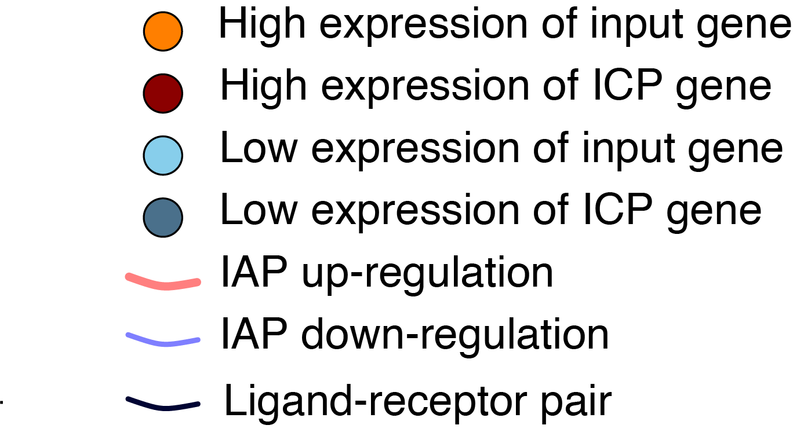

## Interpret results:

### Table:

For each gene pair, a synergy score and three statistical assessments are calculated. Gene1Expr and Gene2Expr columns show expression levels of Gene1 and Gene2 correspondingly. A positive synergy score with both gene expressions marked as "High" indicates a synergistic increase of Immune-associated phenotype (IAP) level in response to high expression of both genes. A negative synergy score with both genes marked as "High" indicates synergistic decrease of IAP level in response to high expression of both genes. The higher the absolute value of a synergy score is, the stronger the two genes co-associate with IAP levels.

Similarly, A positive synergy score with both gene expressions marked as "Low" indicates a synergistic increase of Immune-associated phenotype (IAP) level in response to low expression of both genes. A negative synergy score with both genes marked as "low" means synergistic decrease of IAP level in response to low expression of both genes.

Three statistical measurements include:

<ul>

<li>An unpaired Wilcoxon signed-rank pvalue, that evaluates the largest of the three pvalues in the boxplot below.</li>

<li>A specificity p.value, that measures the probability of finding a score higher than the observed synergy score, by randomly pairing a gene from genome to any of genes in the lists. A lower p.value indicates a more specific results.</li>

<li>A Sensitivity R coefficient, that measures the sensitivity of the observed synergy score to the exact data configuration. The more robust scores, therefore the least sensitive ones, have lower sensitivityR.</li>

</ul>

Finally, the last column shows whether the two genes are a known ligand-receptor pair.

### Network:

A color coded graphical network of combinatorial associations is shown in the "Network" section. Red (Blue) edges represent synergistic up-regulation (down-regulation) of IAP. Dark red (Dark blue) vertices identify high expression (low expression) of immune checkpoint (ICP) genes, and orange (blue) vertices identify high expression (low expression) of oncogenes. A solid black edge indicates an existing ligand-receptor interaction between two adjacent vertices. The graphics below summarizes network color-codings.

A cutoff parameter is included to subset the list to those pairs with absolute value of synergy scores higher than the cutoff percentile value. For example, a cutoff of 80 will exclude 80% of scores that are lowest in absolute value.

### Boxplot

To help user interpret their results, samples are subsetted and stratified to four sub-cohorts according to their gene expression levels. High/low expression levels are determined using the upper/lower quartile of the corresponding gene expression. p.values are calculated using unpaired Wilcoxon signed-rank test. Use the drop-down menu io see boxplot for a different gene-pair.

For more information see <https://doi.org/10.1101/2021.10.06.462889>
Cite like: ...
Contact us at: 

